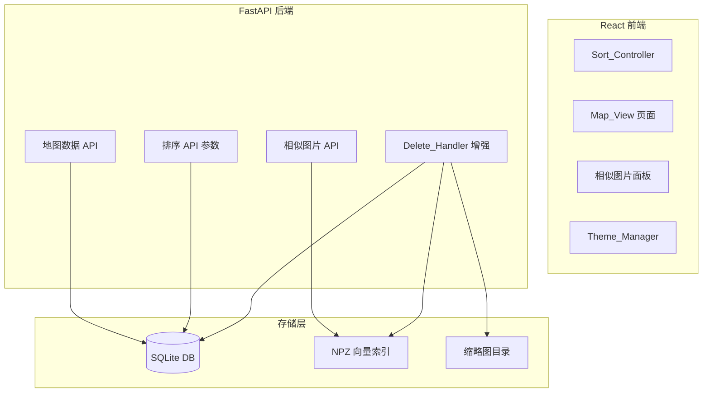

# 设计文档

## 概述

本设计文档涵盖 DINO Gallery 的六项增强功能。这些功能分为三类：

1. **数据完整性修复**（需求 1、2、4）：修复删除图片时向量索引和缩略图未清理的问题，移除未使用的 tags 表
2. **新功能**（需求 3、5、6）：图片排序、地图视图、相似图片推荐
3. **UI 增强**（需求 7）：暗色/亮色主题切换

当前系统的关键问题：`DELETE /api/images/{id}` 仅删除 SQLite 记录，未清理 DINO/CLIP 向量索引和缩略图文件，导致孤立数据。本设计将在后端删除流程中集成完整的资源清理链。

## 架构

### 整体架构不变

保持现有 Tauri 2 + React 前端 + Python FastAPI sidecar 后端的架构。变更集中在以下层面：



### 变更范围

| 需求 | 后端变更 | 前端变更 | 数据库变更 |
|------|---------|---------|-----------|
| 1. 向量清理 | `indexer.py` 新增 remove 函数，`images.py` / `duplicates.py` 调用 | 无 | 无 |
| 2. 缩略图清理 | `images.py` 删除时清理缩略图文件 | 无 | 无 |
| 3. 排序 | `queries.py` 支持排序参数，`images.py` 接收排序参数 | `GalleryPage` 新增排序控件 | 无 |
| 4. 移除 tags | `schema.sql` 移除 tags 表，`database.py` 迁移逻辑 | 无 | DROP TABLE tags |
| 5. 地图视图 | `pipeline.py` 提取 GPS，新增 `map.py` API | 新增 `MapPage`，侧边栏添加入口 | images 表新增 latitude/longitude |
| 6. 相似推荐 | 新增 `similar.py` API，复用 `indexer.search_dino_index` | `ImageViewer` 新增相似图片区域 | 无 |
| 7. 主题切换 | 无 | `globals.css` CSS 变量，`SettingsPage` 主题控件，`ThemeProvider` | 无 |

## 组件与接口

### 需求 1 & 2：删除资源清理

在 `backend/core/indexer.py` 中新增两个函数：

```python
def remove_from_dino_index(data_dir: str, image_id: int) -> bool:
    """从 DINO 索引中移除指定图片的向量。返回是否实际移除了数据。"""

def remove_from_clip_index(data_dir: str, image_id: int) -> bool:
    """从 CLIP 索引中移除指定图片的向量。返回是否实际移除了数据。"""
```

在 `backend/api/images.py` 的 `DELETE /api/images/{id}` 端点中，删除前执行清理：

```python
@router.delete("/images/{image_id}")
async def remove_image(image_id: int, request: Request):
    img = get_image_by_id(image_id)
    if not img:
        raise HTTPException(404, "Image not found")
    data_dir = request.app.state.data_dir
    # 1. 清理向量索引
    remove_from_dino_index(data_dir, image_id)
    remove_from_clip_index(data_dir, image_id)
    # 2. 清理缩略图
    _cleanup_thumbnail(img.get("thumbnail"))
    # 3. 删除数据库记录
    delete_image(image_id)
    return {"ok": True}
```

`duplicates.py` 的 `resolve_duplicates` 端点同样需要对每个 `delete_ids` 执行相同的清理流程。

### 需求 3：排序 API

修改 `GET /api/images` 端点，新增查询参数：

```
GET /api/images?page=1&size=50&sort_by=created_at&sort_order=desc
```

- `sort_by`: `created_at`（默认）| `taken_at` | `file_size` | `file_path`
- `sort_order`: `desc`（默认）| `asc`
- 当 `sort_by=taken_at` 时，NULL 值排在最后（使用 `COALESCE` 或 `CASE WHEN`）

前端 `Sort_Controller` 组件：在 Gallery 页面 header 中添加排序下拉菜单和方向切换按钮。

### 需求 4：移除 tags 表

- 从 `schema.sql` 中删除 `CREATE TABLE tags` 和相关索引
- 在 `database.py` 的 `_run_migrations` 中添加 `DROP TABLE IF EXISTS tags`

### 需求 5：地图视图

后端新增 `backend/api/map.py`：

```python
@router.get("/map/images")
async def get_map_images():
    """返回所有有 GPS 坐标的图片，包含 id, latitude, longitude, thumbnail 字段。"""
```

EXIF GPS 提取：修改 `pipeline.py` 中的 `read_exif_date` 为更通用的 `read_exif_metadata`，同时提取日期和 GPS 坐标。GPS 坐标从 EXIF GPSInfo tag（tag ID 34853）中提取，将度分秒（DMS）格式转换为十进制度数。

数据库变更：
- `images` 表新增 `latitude REAL` 和 `longitude REAL` 字段
- `insert_image` 函数新增 `latitude` 和 `longitude` 参数
- 迁移逻辑中 `ALTER TABLE images ADD COLUMN latitude REAL` / `longitude REAL`

前端：
- 新增 `src/pages/MapPage.tsx`，使用 `react-leaflet` + OpenStreetMap 瓦片
- 侧边栏 `libraryItems` 中添加 Map 入口
- 地图标记点点击时显示缩略图弹窗
- 需要安装依赖：`leaflet`、`react-leaflet`、`@types/leaflet`

### 需求 6：相似图片推荐

后端新增 `backend/api/similar.py`：

```python
@router.get("/images/{image_id}/similar")
async def get_similar_images(image_id: int, request: Request, limit: int = 12):
    """使用 DINOv2 向量索引查找相似图片。"""
```

实现逻辑：
1. 从 DINO 索引中获取目标图片的特征向量
2. 调用 `search_dino_index` 搜索最相似的 `limit + 1` 张图片
3. 过滤掉查询图片自身
4. 返回前 `limit` 张结果

前端：在 `ImageViewer` 底部新增可折叠的相似图片推荐区域，使用水平滚动的缩略图列表。

### 需求 7：主题切换

采用 Tailwind CSS v4 的 `dark` 模式 + CSS 变量方案：

- `globals.css` 中定义两套 CSS 变量（`:root` 为亮色，`.dark` 为暗色）
- 创建 `src/hooks/useTheme.tsx` 提供 `ThemeProvider` 和 `useTheme` hook
- 主题偏好存储在 `localStorage` 的 `theme` key 中
- 通过在 `<html>` 元素上切换 `dark` class 来切换主题
- 默认暗色主题（当前已有的配色方案作为暗色主题基础）
- `SettingsPage` 中添加主题切换控件

前端 API：

```typescript
interface ThemeContextValue {
  theme: "dark" | "light";
  setTheme: (theme: "dark" | "light") => void;
}
```

## 数据模型

### 数据库 Schema 变更

#### images 表新增字段

```sql
ALTER TABLE images ADD COLUMN latitude REAL;
ALTER TABLE images ADD COLUMN longitude REAL;
```

#### 移除 tags 表

```sql
DROP TABLE IF EXISTS tags;
```

更新后的 `schema.sql`（tags 相关部分移除）：

```sql
CREATE TABLE IF NOT EXISTS images (
    id          INTEGER PRIMARY KEY AUTOINCREMENT,
    file_path   TEXT UNIQUE NOT NULL,
    file_hash   TEXT NOT NULL,
    file_size   INTEGER,
    width       INTEGER,
    height      INTEGER,
    format      TEXT,
    taken_at    DATETIME,
    created_at  DATETIME DEFAULT CURRENT_TIMESTAMP,
    thumbnail   TEXT,
    is_favorite INTEGER DEFAULT 0,
    latitude    REAL,
    longitude   REAL
);
```

### 前端类型变更

```typescript
// ImageInfo 新增字段
export interface ImageInfo {
  // ... 现有字段
  latitude: number | null;
  longitude: number | null;
}

// 新增地图图片类型
export interface MapImage {
  id: number;
  latitude: number;
  longitude: number;
  thumbnail: string;
}

// 新增相似图片结果类型
export interface SimilarImage {
  image: ImageInfo;
  score: number;
}
```

### 向量索引数据结构（无变更）

DINO 和 CLIP 索引继续使用现有的 `dict[int, np.ndarray]` 内存结构 + NPZ 持久化。新增的 `remove_from_*_index` 函数直接操作内存字典并重新保存 NPZ 文件。

### 主题存储

```
localStorage key: "theme"
值: "dark" | "light"
默认值: "dark"
```


## 正确性属性

*属性（Property）是指在系统所有有效执行中都应保持为真的特征或行为——本质上是对系统应做什么的形式化陈述。属性是人类可读规范与机器可验证正确性保证之间的桥梁。*

### 属性 1：向量索引移除

*对于任意*向量索引（DINO 或 CLIP）和任意存在于该索引中的 image_id，调用 remove 函数后，该 image_id 不应再存在于索引中，且索引中其他条目应保持不变。

**验证需求：1.1, 1.2**

### 属性 2：向量索引移除持久化往返

*对于任意*向量索引，添加一组随机向量后移除其中一个 image_id，保存到 NPZ 文件后重新加载，加载后的索引应不包含被移除的 image_id，且包含所有未被移除的条目。

**验证需求：1.3**

### 属性 3：批量删除清理所有向量

*对于任意*一组 image_id 集合（delete_ids），执行批量重复图片解决后，DINO 和 CLIP 索引中均不应包含 delete_ids 中的任何 image_id。

**验证需求：1.5**

### 属性 4：删除时清理缩略图文件

*对于任意*具有有效缩略图路径的图片，执行删除操作后，该缩略图文件不应再存在于磁盘上。

**验证需求：2.1**

### 属性 5：排序结果有序性

*对于任意*有效排序字段（created_at, taken_at, file_size, file_path）和排序方向（asc, desc），API 返回的图片列表应严格按照指定字段和方向排序。

**验证需求：3.4**

### 属性 6：taken_at 为 NULL 时排在最后

*对于任意*包含部分 taken_at 为 NULL 的图片集合，按 taken_at 排序时（无论升序或降序），所有 taken_at 为 NULL 的图片应排在所有有值图片之后。

**验证需求：3.5**

### 属性 7：GPS EXIF 提取准确性

*对于任意*包含有效 GPS EXIF 数据的图片，提取函数返回的纬度和经度应与 EXIF 中编码的原始坐标值一致（在浮点精度范围内）。

**验证需求：5.1**

### 属性 8：地图 API 精确过滤 GPS 图片

*对于任意*数据库中的图片集合，地图 API 返回的图片集合应恰好等于 latitude 和 longitude 均非 NULL 的图片集合。

**验证需求：5.3, 5.6**

### 属性 9：相似图片 API 约束

*对于任意*存在于 DINO 索引中的 image_id，相似图片 API 返回的结果应满足：(a) 结果数量不超过 12，(b) 不包含查询图片自身，(c) 所有相似度分数在 [-1, 1] 范围内，(d) 结果按相似度降序排列。

**验证需求：6.1, 6.2, 6.3**

### 属性 10：主题持久化往返

*对于任意*主题值（"dark" 或 "light"），设置主题后从 localStorage 读取应返回相同的值；应用重新初始化时应从 localStorage 恢复该主题。

**验证需求：7.4, 7.5**

## 错误处理

### 删除流程错误处理

| 场景 | 处理方式 |
|------|---------|
| 向量索引中不存在目标 image_id | 静默跳过，不抛出异常（需求 1.4） |
| 缩略图路径为 None 或空字符串 | 跳过缩略图清理步骤（需求 2.2） |
| 缩略图文件不存在 | 跳过，不抛出异常（需求 2.2） |
| 缩略图文件删除失败（权限等） | 记录 warning 日志，继续完成数据库删除（需求 2.3） |
| NPZ 文件保存失败 | 记录 error 日志，内存中的索引仍然是正确的，下次保存时会重试 |

### 排序错误处理

| 场景 | 处理方式 |
|------|---------|
| 无效的 sort_by 值 | 回退到默认值 `created_at` |
| 无效的 sort_order 值 | 回退到默认值 `desc` |

### 地图视图错误处理

| 场景 | 处理方式 |
|------|---------|
| EXIF 中 GPS 数据格式异常 | 记录 warning，latitude/longitude 存为 NULL |
| GPS 坐标超出有效范围（纬度 ±90，经度 ±180） | 视为无效，存为 NULL |
| Leaflet 地图加载失败（离线等） | 显示友好的错误提示信息 |

### 相似图片错误处理

| 场景 | 处理方式 |
|------|---------|
| 查询图片不在 DINO 索引中 | 返回空列表（需求 6.4） |
| 图片不存在（404） | 返回 HTTP 404 |
| DINO 索引为空 | 返回空列表 |

### 主题切换错误处理

| 场景 | 处理方式 |
|------|---------|
| localStorage 不可用 | 回退到默认暗色主题，不持久化 |
| localStorage 中存储了无效值 | 忽略，使用默认暗色主题 |

## 测试策略

### 双重测试方法

本项目采用单元测试 + 属性测试的双重测试策略：

- **单元测试**：验证具体示例、边界情况和错误条件
- **属性测试**：验证跨所有输入的通用属性

两者互补，缺一不可。单元测试捕获具体 bug，属性测试验证通用正确性。

### 属性测试配置

- **Python 后端**：使用 `hypothesis` 库
- **TypeScript 前端**：使用 `fast-check` 库
- 每个属性测试最少运行 **100 次迭代**
- 每个属性测试必须用注释引用设计文档中的属性编号
- 标签格式：**Feature: gallery-enhancements, Property {number}: {property_text}**
- 每个正确性属性由**单个**属性测试实现

### 后端测试（Python + Hypothesis）

#### 属性测试

| 属性 | 测试描述 | 生成器 |
|------|---------|--------|
| P1 | 向量索引移除 | 随机 image_id + 随机 768/512 维向量 |
| P2 | 向量索引移除持久化往返 | 随机索引内容 + 临时 NPZ 文件 |
| P3 | 批量删除清理所有向量 | 随机 image_id 集合 |
| P4 | 删除时清理缩略图 | 临时文件路径 |
| P5 | 排序结果有序性 | 随机图片记录 + 随机排序字段/方向 |
| P6 | taken_at NULL 排序 | 混合 NULL/非 NULL taken_at 的随机图片 |
| P7 | GPS EXIF 提取 | 随机有效 GPS 坐标（纬度 ±90，经度 ±180） |
| P8 | 地图 API GPS 过滤 | 混合有/无 GPS 的随机图片记录 |
| P9 | 相似图片 API 约束 | 随机 DINO 向量索引 |

#### 单元测试

- 删除不存在的 image_id 时向量索引不报错（边界情况，需求 1.4）
- 缩略图路径为 None 时跳过清理（边界情况，需求 2.2）
- 缩略图文件不存在时跳过清理（边界情况，需求 2.2）
- 缩略图删除权限失败时继续（边界情况，需求 2.3）
- 迁移后 tags 表不存在（示例，需求 4.3）
- 查询图片不在索引中时返回空列表（边界情况，需求 6.4）
- 默认排序为 created_at desc（示例，需求 3.3）

### 前端测试（TypeScript + fast-check）

#### 属性测试

| 属性 | 测试描述 | 生成器 |
|------|---------|--------|
| P10 | 主题持久化往返 | 随机 "dark" \| "light" 值 |

#### 单元测试

- localStorage 无主题记录时默认暗色（边界情况，需求 7.6）
- 排序控件包含所有指定字段（示例，需求 3.1）
- 排序控件提供升序和降序选项（示例，需求 3.2）
- 侧边栏包含 Map 导航入口（示例，需求 5.7）
- 主题切换控件存在于 Settings 页面（示例，需求 7.1）
